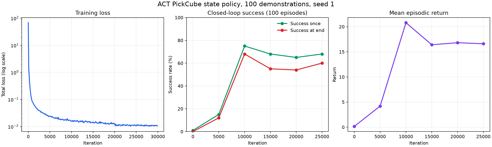
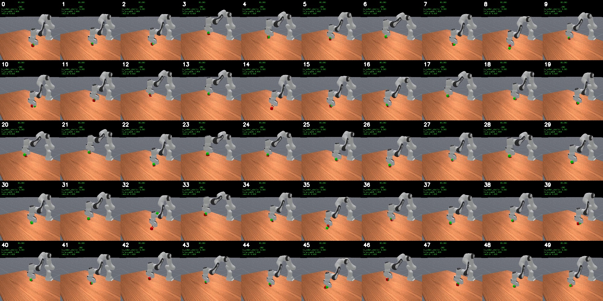

# 基于 ACT 的 ManiSkill PickCube 策略训练与评估

> **English summary:** This portfolio project trains a state-based Action
> Chunking with Transformers (ACT) policy on 100 ManiSkill PickCube
> demonstrations, evaluates it in closed loop, and adds a reproducible
> checkpoint-to-video evaluation workflow. The best periodic evaluation reached
> 75% `success_once` and 68% `success_at_end` over 100 episodes.

这是一个基于 [ManiSkill](https://github.com/haosulab/ManiSkill) 的项目型 fork，目标是完整走通：

```text
官方示范 -> 状态轨迹回放 -> ACT 训练 -> 周期闭环评估
                                      -> checkpoint 独立评估 -> 视频案例
```

仓库保留 ManiSkill 上游源码、许可证和引用信息。项目新增内容集中在 ACT 的 Gymnasium 兼容性、checkpoint 评估、复现脚本、实验结果和学习路线。

## 当前结果

核心实验使用 `PickCube-v1`、`pd_ee_delta_pos`、100 条 motion-planning 示范和 `seed=1`，训练 30,000 次迭代。TensorBoard 最后一条训练标量位于 29,900 次迭代；周期评估每次包含 100 个 episode。

| 评估口径 | 迭代/checkpoint | Episodes | `success_once` | `success_at_end` | 平均回报 |
|---|---:|---:|---:|---:|---:|
| 最佳周期评估 | 10,000 | 100 | 75% | 68% | 20.79 |
| 最后周期评估 | 25,000 | 100 | 68% | 60% | 16.60 |
| 已有视频批次 | `best_eval_success_at_end.pt` | 50 | 100% | 100% | 未记录 |
| Fresh CPU 验证 | `best_eval_success_at_end.pt` | 10 | 70% | 60% | 20.10 |

已有视频批次的 50 个末帧叠加指标均显示成功，但当时没有保留控制台设备信息。仓库整理时重新执行的 CPU 评估结果较低，表明闭环轨迹可能对推理设备造成的数值差异敏感。这两批结果均与训练期间的 100-episode 周期评估分开记录。



下图是独立 checkpoint 评估的 50 个回合末帧，画面叠加指标均显示成功：



代表视频：[0](assets/videos/best_eval_success_at_end/0.mp4) · [1](assets/videos/best_eval_success_at_end/1.mp4) · [2](assets/videos/best_eval_success_at_end/2.mp4) · [3](assets/videos/best_eval_success_at_end/3.mp4) · [4](assets/videos/best_eval_success_at_end/4.mp4) · [完整目录](assets/videos/best_eval_success_at_end/)

完整标量数据见 [`results/metrics.csv`](results/metrics.csv)，实验分析见 [`report/experiment_report.md`](report/experiment_report.md)。

## 快速复现

推荐 Ubuntu、NVIDIA GPU、Conda/Miniconda 和至少 50 GB 可用磁盘。当前验证环境为 Python 3.11.16、ManiSkill 3.0.1、Gymnasium 1.3.0 和 PyTorch 2.10.0+cu128。

所有命令都从仓库根目录执行。

### 1. 创建 ManiSkill ACT 环境

```bash
conda env create -f environment/maniskill.yml
conda activate maniskill-act311
```

`environment/maniskill.yml` 包含本仓库和 ACT baseline 的 editable install，因此创建环境时必须位于仓库根目录。若本机 CUDA 与示例环境不同，应先按照 [PyTorch 官方说明](https://pytorch.org/get-started/locally/)选择匹配的 wheel。

### 2. 下载并回放示范

```bash
scripts/act_pickcube/download_demo.sh
scripts/act_pickcube/replay_state.sh
```

默认训练数据路径为：

```text
~/.maniskill/demos/PickCube-v1/motionplanning/
trajectory.state.pd_ee_delta_pos.physx_cpu.h5
```

### 3. 冒烟测试与正式训练

```bash
scripts/act_pickcube/train_smoke.sh
scripts/act_pickcube/train_state.sh
```

脚本支持用环境变量覆盖配置，例如：

```bash
SEED=2 NUM_DEMOS=50 TOTAL_ITERS=30000 \
  scripts/act_pickcube/train_state.sh
```

主要可覆盖项包括 `DEMO_PATH`、`NUM_DEMOS`、`SEED`、`TOTAL_ITERS`、`BATCH_SIZE`、`NUM_EVAL_EPISODES` 和 `NUM_EVAL_ENVS`。

### 4. 从 checkpoint 独立评估并生成视频

```bash
scripts/act_pickcube/evaluate_checkpoint.sh \
  examples/baselines/act/runs/act-PickCube-v1-state-100demos-seed1/checkpoints/best_eval_success_at_end.pt
```

也可以直接使用 Python 入口：

```bash
cd examples/baselines/act
python evaluate_checkpoint.py \
  --checkpoint runs/act-PickCube-v1-state-100demos-seed1/checkpoints/best_eval_success_at_end.pt \
  --num-eval-episodes 50 \
  --num-eval-envs 1
```

默认视频目录为 `runs/<experiment>/videos/<checkpoint-name>/`。`num_queries`、Transformer 层数、隐藏维度等模型结构参数必须与生成 checkpoint 时的训练配置一致。

## 仓库结构

```text
environment/                 独立的 ManiSkill 与 LeRobot 环境
scripts/act_pickcube/        下载、回放、训练和 checkpoint 评估入口
examples/baselines/act/      ManiSkill ACT baseline 与项目评估代码
results/                     可追溯的标量摘要和曲线
assets/                      精选评估视频与末帧总览
report/                      当前实验报告
docs/project-roadmap.md      后续项目路线
docs/experiment-protocol.md  对照实验与评估规范
```

## 个人实现内容

- 修复 Gymnasium 新版 vector environment 在 CPU 评估中的 autoreset 行为，使用 `SAME_STEP` 保留 `final_info`。
- 让评估代码同时支持 NumPy 与 Tensor episode metrics，并过滤 Gymnasium 自动生成的 `_metric` 掩码字段。
- 新增 EMA checkpoint 加载与独立闭环评估入口，支持 CPU/GPU、随机种子、并行环境和视频目录配置。
- 为以上行为补充 7 个回归测试。
- 提供从数据下载到训练、评估、结果展示的可复现项目结构。

## 局限性

- 当前定量结果只有一个随机种子，不能据此得出稳定的均值和标准差。
- 已有 50/50 视频批次没有保留设备信息；fresh CPU 复查只有 70%/60%，需要在固定设备上重复验证。
- 精选的 50 回合视频批次没有失败案例；fresh CPU 复查观察到失败，但临时验证视频不作为精选媒体提交。
- 当前策略使用环境 state，而不是 RGB 图像，尚未验证视觉泛化与 sim-to-real。
- checkpoint 和原始数据不进入 Git。需要先运行训练脚本，才能复现 checkpoint 评估。

## 后续路线

下一步优先完成 `seed=0/1/2` 的 100-episode 对照评估，再升级到单摄像头 RGB 输入和视觉域随机化。实体机械臂与语言条件控制保留为后续阶段，详见 [`docs/project-roadmap.md`](docs/project-roadmap.md)。

## 上游项目、引用与许可证

本仓库基于 [haosulab/ManiSkill](https://github.com/haosulab/ManiSkill)，ACT baseline 改编自 [tonyzhaozh/act](https://github.com/tonyzhaozh/act)。使用本项目时请同时参考仓库中的 [`CITATION.cff`](CITATION.cff)、[`CITATION_MS2.cff`](CITATION_MS2.cff)、[`LICENSE`](LICENSE) 和 [`LICENSE-3RD-PARTY`](LICENSE-3RD-PARTY)。
