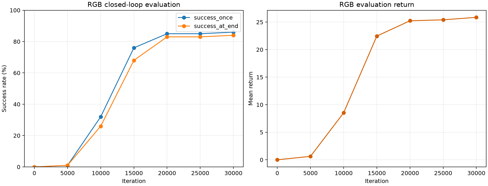
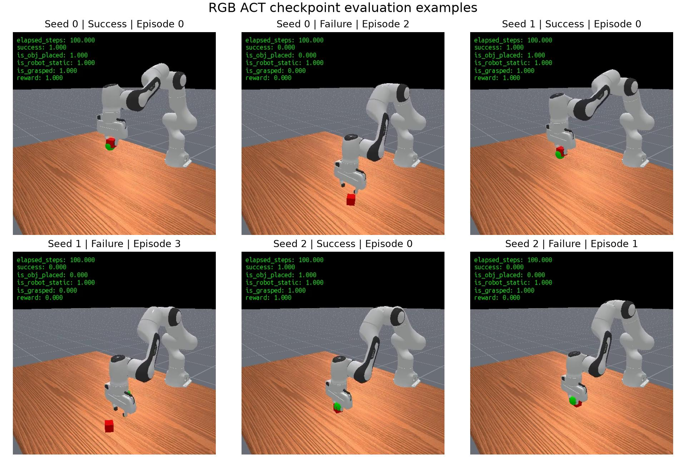
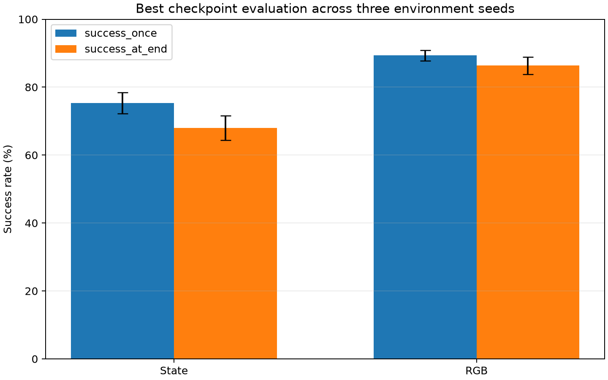

# ACT PickCube RGB 与 State 实验报告

## 摘要

本项目使用 ManiSkill `PickCube-v1` 的 100 条 motion-planning 示范训练 ACT 策略。当前主结果为 RGB 图像输入（不含 depth）的策略：训练至 30,000 次迭代后，100-episode 周期评估达到 `success_once=86%`、`success_at_end=84%`。同一 best checkpoint 在环境评估 seed 0、1、2 上各运行 100 个 episode，得到 `success_once=89.33% ± 1.53 pp`、`success_at_end=86.33% ± 2.52 pp`、平均回报 `27.26 ± 1.56`（均值 ± 样本标准差）。State ACT 作为已完成的工程基线保留。

## RGB 实验设置

| 项目 | 配置 |
|---|---|
| 环境 | `PickCube-v1` |
| 图像观测 | RGB，不含 depth |
| 控制模式 | `pd_ee_delta_pos` |
| 仿真后端 | `physx_cpu` |
| 示范数量 | 100 |
| 训练迭代 | 30,000（`total_iters=30001`） |
| 训练 seed | 1 |
| Batch size | 4 |
| Backbone | ResNet18 |
| ACT | encoder 2、decoder 4、hidden dim 256、8 heads、30 queries |
| 周期评估 | 100 episodes、4 environments |
| Checkpoint 评估 | 3 个环境 seed × 100 episodes |
| 软件 | Python 3.11.16、ManiSkill 3.0.1、Gymnasium 1.3.0、PyTorch 2.10.0+cu128 |
| 硬件 | 原始日志未记录，不能可靠补写 |

TensorBoard 共记录 301 个 RGB loss 点，范围为 step 0 到 30,000。Loss 从 77.8555 下降到 0.0127286。

## RGB 训练结果

| Iteration | `success_once` | `success_at_end` | 平均回报 |
|---:|---:|---:|---:|
| 0 | 0% | 0% | 0.00 |
| 5,000 | 1% | 1% | 0.62 |
| 10,000 | 32% | 26% | 8.53 |
| 15,000 | 76% | 68% | 22.46 |
| 20,000 | 85% | 83% | 25.24 |
| 25,000 | 85% | 83% | 25.41 |
| 30,000 | 86% | 84% | 25.86 |

## RGB Checkpoint 独立评估

| 环境 seed | Episodes | `success_once` | `success_at_end` | 平均回报 | 平均 reward |
|---:|---:|---:|---:|---:|---:|
| 0 | 100 | 89% | 86% | 27.43 | 0.2743 |
| 1 | 100 | 91% | 89% | 28.73 | 0.2873 |
| 2 | 100 | 88% | 84% | 25.62 | 0.2562 |
| 均值 ± 样本标准差 | 100/seed | 89.33% ± 1.53 pp | 86.33% ± 2.52 pp | 27.26 ± 1.56 | 0.2726 ± 0.0156 |

三个结果来自同一个训练 seed=1 的 checkpoint。评估 seed 控制环境初始条件和随机数，不能解释为三个独立训练模型的稳定性。完整 300 段视频保留在被忽略的 `runs/` 中；仓库只提交每个 seed 各一个成功和失败案例。

## 与 State 基线对照

| 模型 | Checkpoint `success_once` | Checkpoint `success_at_end` | 平均回报 |
|---|---:|---:|---:|
| State ACT | 75.33% ± 3.06 pp | 68.00% ± 3.61 pp | 20.58 ± 0.51 |
| RGB ACT | 89.33% ± 1.53 pp | 86.33% ± 2.52 pp | 27.26 ± 1.56 |

该表比较两套已完成实验，不是严格的模态消融。除输入外，batch size、视觉 backbone、attention heads 和训练实现细节也不同。后续需要固定共同结构与训练预算后重跑，才能估计输入模态的独立影响。

## 工程改动

- RGB evaluator 按训练配置重建 policy，加载 EMA 权重，并支持设备、seed、episode 数、并行环境和输出目录参数。
- `Agent.include_depth` 由实例保存，独立推理不再依赖训练脚本的全局 `args`。
- CPU vector evaluation 使用 Gymnasium `SAME_STEP` autoreset，保留 episode 结束时的 `final_info`。
- 指标收集兼容 NumPy/Tensor，并忽略 `_metric` 掩码字段。
- RGB/state 的训练与 checkpoint 评估均有根目录 shell wrapper 和回归测试。

## 局限性与后续工作

- 两种模型均只有一个训练 seed，样本标准差仅描述评估环境 seed 间变化。
- 没有记录 GPU 型号、峰值显存、推理设备或逐回合延迟。
- 尚未完成严格控制变量的 RGB/state 消融。
- 尚未测试视觉域随机化、未见相机条件和实体机械臂迁移。
