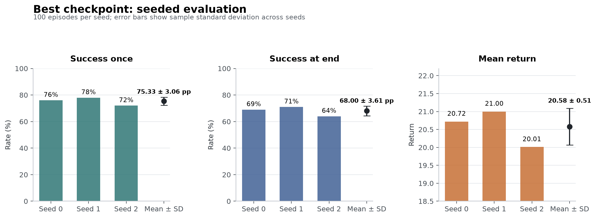

# ACT PickCube State Policy 实验报告

## 摘要

本实验使用 ManiSkill `PickCube-v1` 的 100 条 motion-planning 示范训练状态输入 ACT 策略，并在闭环环境中周期评估。训练执行 30,000 次迭代，100-episode 周期评估的最佳 `success_once` 为 75%，最佳 `success_at_end` 为 68%。对同一个 best checkpoint 使用评估 seed 0、1、2 各运行 100 个 episode，跨 seed 结果为 `success_once=75.33% ± 3.06 pp`、`success_at_end=68.00% ± 3.61 pp`、平均回报 `20.58 ± 0.51`（均值 ± 样本标准差）。

## 实验设置

| 项目 | 配置 |
|---|---|
| 环境 | `PickCube-v1` |
| 观测 | state |
| 控制模式 | `pd_ee_delta_pos` |
| 仿真后端 | `physx_cpu` |
| 示范数量 | 100 |
| 训练迭代 | 30,000 |
| Seed | 1 |
| 最大 episode 长度 | 100 |
| 周期评估规模 | 100 episodes |
| Checkpoint 评估规模 | 3 seeds x 100 episodes |
| 软件 | Python 3.11.16、ManiSkill 3.0.1、Gymnasium 1.3.0、PyTorch 2.10.0+cu128 |
| 硬件 | 原始日志未记录，不能可靠补写 |

TensorBoard 共记录 300 个 loss 点，最后一步为 29,900。记录的累计 update 时间约 2,073 秒；该数值不包含所有数据准备和人工操作时间。

## 结果

| Iteration | `success_once` | `success_at_end` | 平均回报 |
|---:|---:|---:|---:|
| 0 | 1% | 0% | 0.16 |
| 5,000 | 15% | 12% | 4.20 |
| 10,000 | 75% | 68% | 20.79 |
| 15,000 | 68% | 55% | 16.40 |
| 20,000 | 65% | 54% | 16.81 |
| 25,000 | 68% | 60% | 16.60 |

训练 loss 从 68.11 下降到 29,900 次迭代时的 0.0106。闭环成功率在 10,000 次迭代达到峰值，之后没有随 loss 持续下降而继续提高，说明 imitation loss 不能代替环境评估，并且最佳 checkpoint 选择是必要的。

## Checkpoint 视频评估

`best_eval_success_at_end.pt` 通过独立入口加载 EMA policy。评估入口将 seed 传入环境首次 reset，并在各 seed 目录保存 100 段视频和 `metrics.json`。

| 评估 seed | Episodes | `success_once` | `success_at_end` | 平均回报 | 平均 reward |
|---:|---:|---:|---:|---:|---:|
| 0 | 100 | 76% | 69% | 20.72 | 0.2072 |
| 1 | 100 | 78% | 71% | 21.00 | 0.2100 |
| 2 | 100 | 72% | 64% | 20.01 | 0.2001 |
| 均值 ± 样本标准差 | 100/seed | 75.33% ± 3.06 pp | 68.00% ± 3.61 pp | 20.58 ± 0.51 | 0.2058 ± 0.0051 |

三组结果来自同一个训练 seed=1 的 checkpoint。评估 seed 控制环境初始条件和随机数，不能解释为三个独立模型的训练稳定性。仓库只提交每个 seed 各一个成功和失败视频作为可视化案例；完整 300 段视频保留在被忽略的 `runs/` 目录中。

## 工程改动

- CPU vector evaluation 使用 Gymnasium `SAME_STEP` autoreset，确保 episode 截断时保留 `final_info`。
- 指标收集兼容 NumPy/Tensor，并忽略 Gymnasium `_metric` 掩码。
- checkpoint 加载器明确使用 EMA 权重，并在 checkpoint 缺少 `ema_agent` 时失败。
- 独立评估入口支持设备、seed、episode 数、并行环境、视频目录和 ACT 结构参数，并持久化 JSON 指标。

## 局限性与后续工作

- 只有一个训练 seed；当前标准差仅描述评估 seed 之间的变化。
- 没有记录硬件型号和峰值显存。
- 当前 `metrics.json` 未记录推理设备，不能用于 CPU/CUDA 对照。
- 精选视频是六个定性案例，不能替代完整评估统计。
- 策略依赖环境 state，尚未覆盖 RGB 泛化和 sim-to-real。
- 下一步补齐独立训练 seed，再开展 10/50/100 demos 与 state/RGB 对照。
